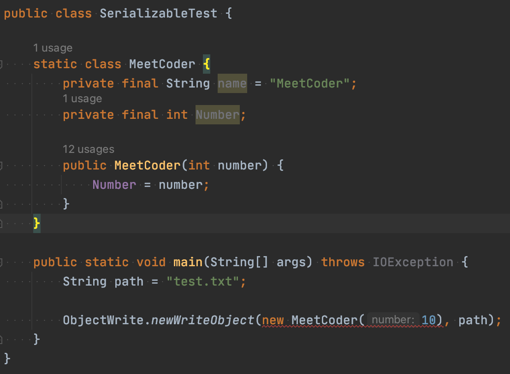

# 정의하려는 것이 타입이라면 마커 인터페이스를 사용하라.

## 마커 인터페이스
 - 자신을 구현하는 클래스가 특정 속성을 가짐을 나타내는 인터페이스
 - 추상 메서드든, 필드든, default, static 메서드든 아무것도 없다.
 - Cloneable, Serializable 같은 인터페이스
 
## 마커 어노테이션
 - 해당 요소가 특정 속성을 가짐을 나타내는 에너테이션
 - @Override, @FunctionalInterface, @SafeVarargs, @Native
 
 
## 마커 에너테이션 vs 마커 인터페이스

### 1. 마커 인터페이스는 [타입] 으로 쓸 수 있다 !
 - 마커 인터페이스와 마커 에너테이션 모두 클래스가 어떤 속성을 가진다는 표시를 할 수 있다.
 - 마커 인터페이스는 타입으로 사용하여 **컴파일타임** 에 오류를 검출할 수 있다.
 - 마커 에너테이션은 **런타임**에서야 오류를 검출할 수 있다.

<br>

[객체를 파일에 작성하는 메서드]
```java 
// 매개변수로 Serializeable 타입을 받도록 했다.
 public static void newWriteObject(Serializable object, String path) {
         File file = new File(path);
 
         try (ObjectOutputStream oops = new ObjectOutputStream(new FileOutputStream(file))) {
             oops.writeObject(object);
         } catch (IOException e) {
             System.out.println("런타임에 에러 발생");
         }
     }
```
[메서드 사용]



 - 인자로 넘기려는 MeetCoder 객체는 Serializable 을 구현하지 않았다 !
 - 결과로 아래와 같이 컴파일오류가 난리를 친다.
 - 해결법으로는 MeetCoder 클래스에 Serializable 을 implements 하여 하위타입으로 만들기만 하면 된다.
 
 <br>
 
[마커 에너테이션]
 - 반면 이를 마커 에너테이션으로 해결하려면, 에너테이션 프로세서를 이용하여 instanceof 를 이용하여 런타임에야 에러를 검출할 수 있다.
 
<br>
<br>
 
## Serializable 의 writeObject()

 writeObject 메서드에서는 ```writeObject0(obj, false);``` 를 통해 객체를 작성한다.
 ```java
private void writeObject0(Object obj, boolean unshared)
    throws IOException {
...
    } else if (obj instanceof Serializable) {
        writeOrdinaryObject(obj, desc, unshared);
    } else {
        if (extendedDebugInfo) {
            throw new NotSerializableException(
                cl.getName() + "\n" + debugInfoStack.toString());
        } else {
            throw new NotSerializableException(cl.getName());
        }
    }
...
```
 - Object 로 객체를 받은 후
 - 여러 조건을 검사하고 마지막으로 Serializable 을 구현했는지 instanceof 로 타입검사를 하고 있다.
 - 마커 인터페이스가 타입으로 쓸 수 있다는 장점을 살리지 못하고 있다.
 
 
<br>
<br>

### 2. 마커 인터페이스는 적용 대상을 더 정밀하게 지정할 수 있다.
 - 마커 에너테이션은 @Retention(RetentionPolicy.TYPE) 에너테이션을 통해 클래스, 인터페이스, enum, 에너테이션에만 달 수 있는 마커를 만들 수 있다.
 - 하지만 마커 인터페이스는 이보다 더 정밀한 제한을 둘 수 있다.
 
예를 들어, Person 인터페이스를 구현한 클래스에만 MeetCoder 스터디원이라는 마커를 달고 싶다는 요구사항이 있다고 생각해보자.  
그러면 MeetCoder 인터페이스 Person 로 확장하고, MeetCoder 인터페이스를 구현하면 된다.
MeetCoder를 구현한 클래스는 자동으로 Person 인터페이스의 하위 타입이 되는 것이고, MeetCoder 가 마커 인터페이스인 것이다.

책의 예시에서는 Collection 을 구현한 클래스에서만 Set 이라는 마커 인터페이스를 사용할 수 있다고 한다.

<br>
<br>

### 3. 에너테이션은 언제 쓸까 ?
 - 마킹하려는 곳이 클래스, 인터페이스가 아닐 때.
 - 에너테이션을 적극 활용하는 프레임워크의 일부에 마커를 달 때.
 
<br>
<br> 
 
#### 결론
 - 마킹된 객체를 매개변수로 받는 메서드를 작성할 일이 있을까 ? -> [예] 라면 마커 인터페이스를 쓰자 !
 - Retention 이 ElementType.TYPE 인 마커 에너테이션을 쓰고 있다 ? -> 마커 인터페이스로 바꿀지 고민해보자. 

[java.util.Collection]